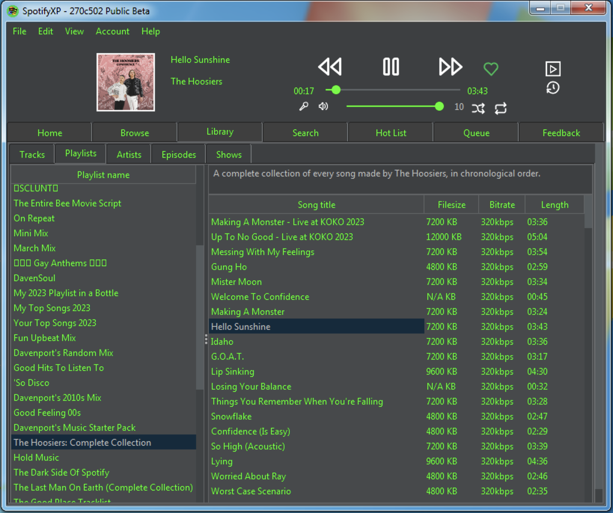

  
<h3 align="center">SpotifyXP</h3>
 

    A working Spotify Player for Windows XP & Above
     
     
    <a href="https://github.com/SpotifyXP/SpotifyXP/wiki">SpotifyXP Wiki</a>
    .
    <a href="https://github.com/SpotifyXP/SpotifyXP/issues">Report Issue</a>
    .
  

 

<!---->

## Table Of Contents

* [About the Project](#about-the-project)
* [The SpotifyXP Wiki](#the-spotifyxp-wiki)
* [System Requirements](#system-requirements)
* [Translating](#translating)
* [Built With](#built-with)
* [Getting Started](#getting-started)
* [Usage](#usage)
* [New Login Methods](#new-login-methods)
* [License](#license)
* [Authors](#authors)
* [Special Thanks](#Special-Thanks)

## About The Project

Stable version

We originally developed SpotifyXP for a computer that runs Windows XP.

<h3>Why use SpotifyXP:</h3>

SpotifyXP keeps the music alive on Windows versions up to 8.1!

## The SpotifyXP Wiki

The SpotifyXP Wiki is available to help when using SpotifyXP.
Check existing issues before reporting a new one.
If not existing, the team'll resolve it 😊

## System Requirements

<h4>Recommended</h4>

* OS: Windows XP & above
* Processor: Anything that can handle SNES Emulation
* RAM: 512MB
* Storage (Without cache): 70MB
* Storage (With cache): 700MB

<h4>Minimum</h4>

* OS: Windows 98 (KernelEx)
* Processor: Anything that can handle SNES Emulation
* RAM: 256MB
* Storage (Without cache): 70MB
* Storage (With cache): 700MB

## Translating

If you want to translate this project look into src/main/resources/lang/skeleton.json

Make sure you have run 'python3 i18nhelper.py -skeleton' to make sure the skeleton is up to date

Rename skeleton.json to [2DigitLanguageCode].json

(English UK & Scotland taken)

## Built With

SpotifyXP is build with <a href="https://github.com/SpotifyXP/SpotifyXP/blob/main/src/main/resources/setup/thirdparty.html">Thirdparty.html</a>

## Getting Started

### Prerequisites:

- <a href="https://www.videolan.org/">VLC</a> Media Player 3
- Java 8 (Build 151 and higher)

### ***!! Important !!***
- Match VLC's architecture (x64 or x86) to your Java version.

### Install instructions

1. Download the latest version under the Actions or Releases tab
Run SpotifyXP.jar, then review the T&Cs.

## Usage

See **New Login Methods*.

Then, enjoy your legally streamed music.

## New login methods
1. Zeroconf: In a modern Spotify client, choose SpotifyXP under devices to authenticate (**Requires Spotify Premium**).
2. OAuth: Log into Spotify in the auto-opened browser window, confirm SpotifyXP connection, then close it. (needs a HTML5 supported browser)

## Compiling

Clone repo with '--recursive', run init.py, build.py, find executable at target/SpotifyXP.jar.

## License

Copyright [2025] [Gianluca Beil]

Licensed under the Apache License, Version 2.0 (the "License");
you may not use this file except in compliance with the License.
You may obtain a copy of the License at

    http://www.apache.org/licenses/LICENSE-2.0

Unless required by applicable law or agreed to in writing, software
distributed under the License is distributed on an "AS IS" BASIS,
WITHOUT WARRANTIES OR CONDITIONS OF ANY KIND, either express or implied.
See the License for the specific language governing permissions and
limitations under the License.

## Authors

* [Werwolf2303](https://github.com/Werwolf2303/)
* [Anthony](https://twitter.com/intent/user?screen_name=anthonydavenpod)

## Special Thanks

* [StapleBacon5037](https://github.com/StapleBacon5037) - For improving the readme
* [skippster1337](https://github.com/skipster1337) - For listing SpotifyXP on his site
* [Jri-creator](https://github.com/Jri-creator) - For the new setup image and improving the readme
* [Anthony](https://twitter.com/intent/user?screen_name=anthonydavenpod) - For improving, spell correcting and simpifying the readme & bug stuff.
