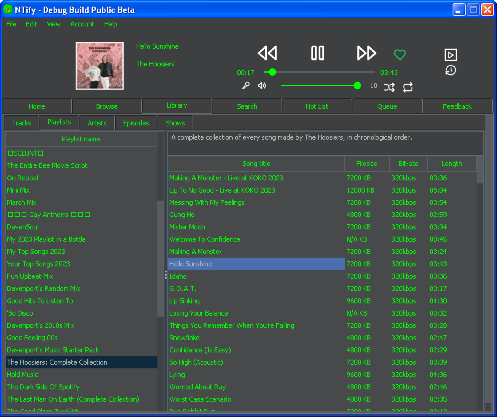

  
<h3 align="center">NTify</h3>
 

    A working Spotify Player for Windows XP.
     
     
    <a href="https://github.com/NTifyApp/NTify/wiki">NTify Wiki</a>
    .
    <a href="https://github.com/NTifyApp/NTify/issues">Report Issue</a>
    .
  

  

<h3>Info: Free accounts are not supported

## Table Of Contents

* [About the Project](#about-the-project)
* [The NTify Wiki](#the-NTify-wiki)
* [System Requirements](#system-requirements)
* [Translating](#translating)
* [Built With](#built-with)
* [Getting Started](#getting-started)
* [Usage](#usage)
* [New Login Methods](#new-login-methods)
* [License](#license)
* [Authors](#authors)
* [Special Thanks](#Special-Thanks)

## About The Project

We originally developed NTify for a computer that runs Windows XP.

<h3>Why use NTify:</h3>

On December 2022, Spotify shutdown it's last version for Windows XP, making this application the only way to listen to it.

## The NTify Wiki

The NTify Wiki is available to help when using NTify.
Check existing issues before reporting a new one.
If not existing, we'll resolve it 😊

## System Requirements

<h4>Recommended</h4>

* OS: Windows XP & above
* Processor: Intel Pentium 4
* RAM: 512MB
* Storage (Without cache): 70MB
* Storage (With cache): 700MB

<h4>Minimum</h4>

* OS: Windows 2000
* Processor: Intel Pentium II 366Mhz
* RAM: 192MB
* Storage (Without cache): 70MB
* Storage (With cache): 700MB

## Translating

If you want to translate this project look into src/main/resources/lang/skeleton.json

Make sure you have run 'python3 i18nhelper.py -skeleton' to make sure the skeleton is up to date

Rename skeleton.json to [2DigitLanguageCode].json

## Built With

NTify is built with <a href="https://github.com/NTify/NTify/blob/main/src/main/resources/setup/thirdparty.html">Thirdparty.html</a>

## Getting Started

### Prerequisites:

- <a href="https://www.videolan.org/">VLC</a> Media Player 3
- Java 8 (Build 151 and higher)

### ***!! Important !!***
- Match VLC's architecture (x64 or x86) to your Java version.

### Install instructions

1. Download the latest version under the Actions or Releases tab
   Run NTify.jar, then review the T&Cs.

## Usage

See **New Login Methods*.

Then, enjoy streaming.

## New login methods
1. Zeroconf: In a modern Spotify client, choose NTify under devices to authenticate.
2. OAuth: Log into Spotify in the auto-opened browser window, confirm NTify connection, then close it. (needs a HTML5 supported browser)

## Compiling

Clone repo with '--recursive', run init.py, build.py, find executable at target/NTify.jar.

## Contributing

Just make your desired changes and open a pull request

### Creating A Pull Request

1. Fork the Project
2. Commit your Changes (`git commit -m 'Add some AmazingFeature'`)
3. Push to the Branch (`git push origin main`)
4. Open a Pull Request

## Licenses

All files within this repo are licensed under the [Apache 2.0 License](https://www.apache.org/licenses/LICENSE-2.0.txt) 
except when stated otherwise. 
 
Copyright to the following images goes to [Anthony](https://twitter.com/intent/user?screen_name=anthonydavenpod):
- The NTify logo
- - The NTify name
- The setup image

## Authors

* [Werwolf2303](https://github.com/Werwolf2303/)

## Special Thanks

* [Werwolf2303](https://github.com/Werwolf2303/) - For working brilliantly on NTify
* [Anthony](https://twitter.com/intent/user?screen_name=anthonydavenpod) - For heavily improving the readme, creating the logo, name & rebranding the setup image.
* [Jri-creator](https://github.com/Jri-creator) - For the base setup image
 
 
  <h3>This site/app is not affiliated with Spotify.</h3>
